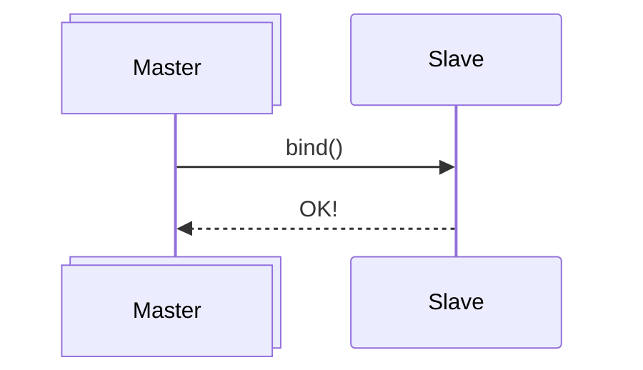
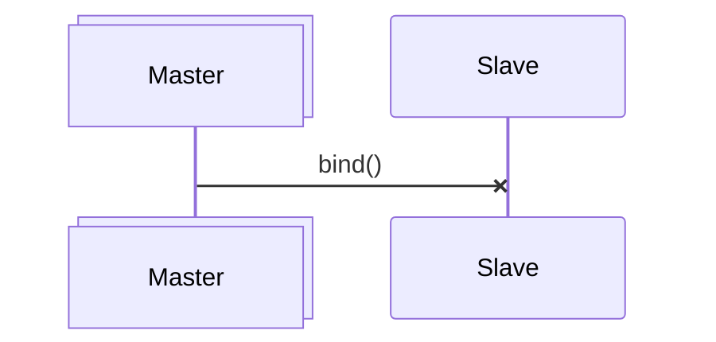
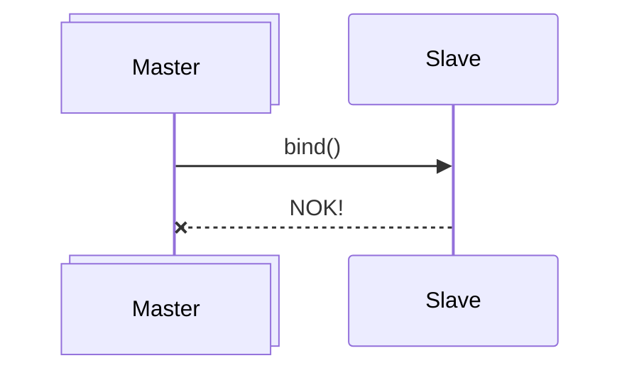
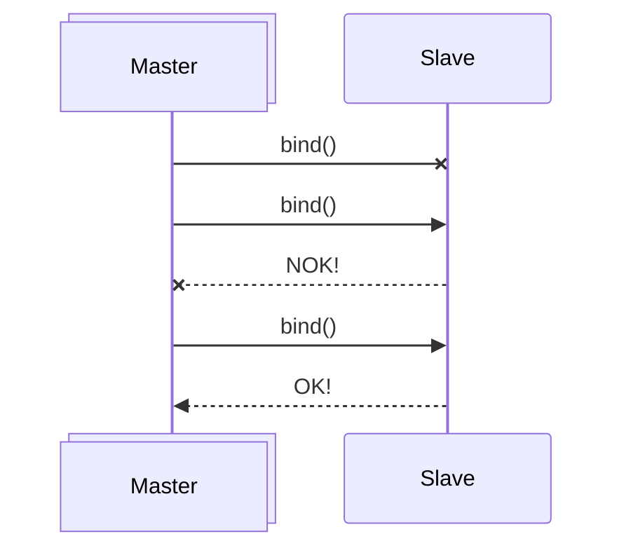

# ERC-20g Multichain Structure

Backed by ERC-7786 adapters and Fungible Standard messaging protocol, a suite of use cases for multichain expansion are embedded in the Fungible Standard Framework.

## Token Perimeter

 

	</img>

 

## Execution Model

 

	</img>

 

## Atomic Operations

### Sucessful Bind

 

 

### Failed Request

 

 

### Failed Response

 

 

### Failed Response with Retry

 

 