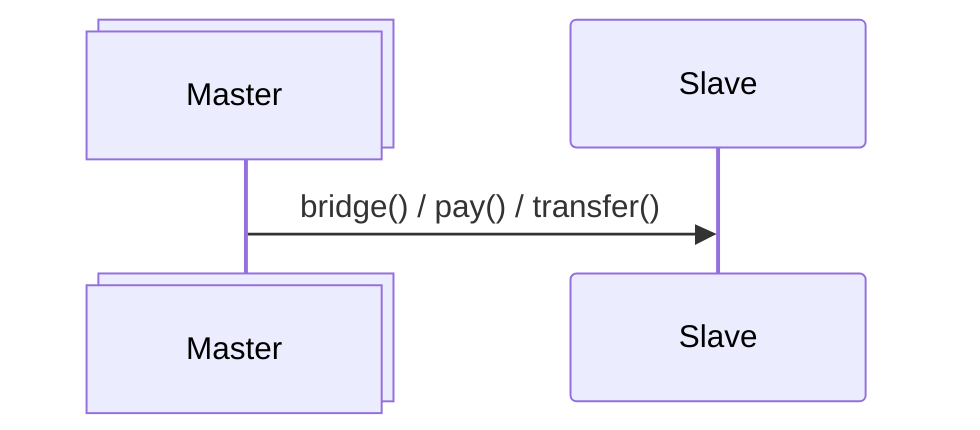
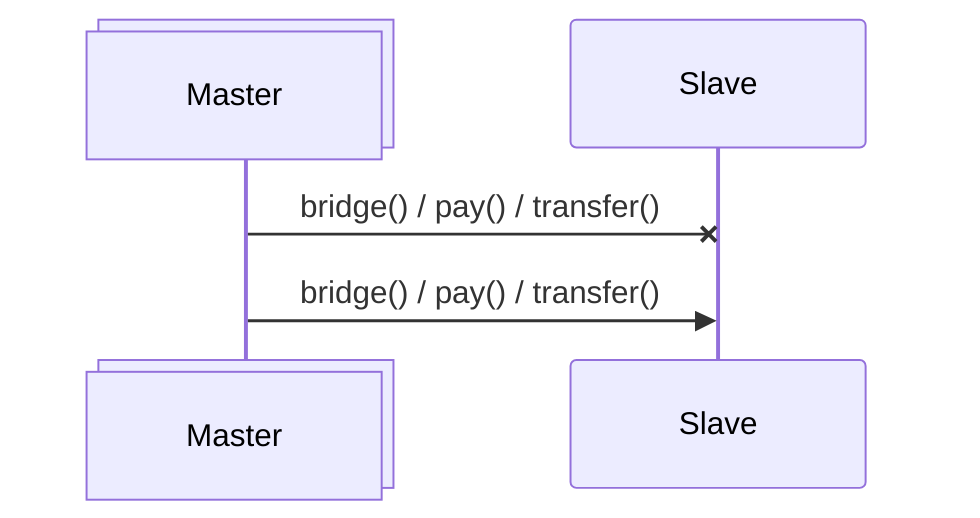

# ERC-20g Multichain Supply 

Especially important for any tokens is management of its supply. Fungible Standard aims to comply with Fungible Principles regarding Supply Management and backups supply snapshots on Bitcoin blockchain.

## Managing Supply

 

	</img>

 

## Execution Model

 

	</img>

 

## Atomic Operations

### Successful Transfer

 

 

### Failed Request with Retry

 

 

## Supply Transfer Mechanisms

### Transfer

### Bridge

### Pay

## Supply by Network